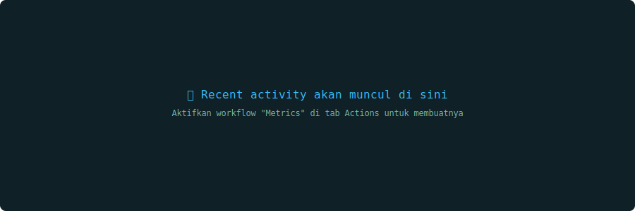
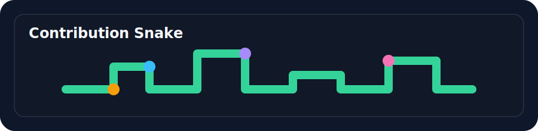

# MCPEServer

  

  

  
  
  

## About

I build modern digital experiences for Minecraft, web, and open-source communities. My focus is on creating clean interfaces, reliable backend systems, and tools that feel useful from day one.

## GitHub Dashboard

  

  

  

  

## Live Activity

  

  

## Metrics

  

## Featured Projects

- Minecraft Bedrock tools and utilities
- Open-source web projects
- Community dashboard and server resources

## Tech Stack

- JavaScript / TypeScript
- React / Next.js
- Node.js / Express
- Tailwind CSS
- GitHub Actions

## Roadmap

- [x] Minecraft tools
- [x] Hosting utilities
- [ ] AI assistant
- [ ] Dashboard platform
- [ ] API services
- [ ] Mobile app

## Support

- GitHub Sponsors
- Ko-fi
- Saweria

---

  <i>Build once. Improve forever.</i>

